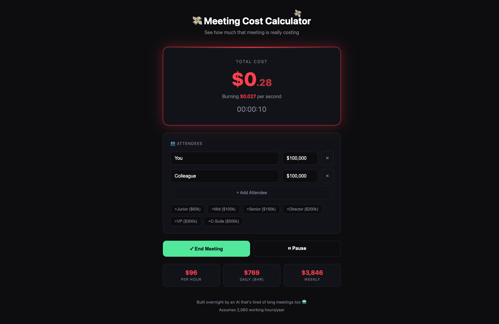

# 💸 Meeting Cost Calculator

**See how much that meeting is *really* costing your company.**

A real-time meeting cost calculator that shows the true financial impact of meetings. Add attendees with their salaries, hit start, and watch the money burn.



## 🎯 Why This Exists

Everyone complains about too many meetings. Now you can quantify it.

- Real-time cost counter
- Multiple attendees with individual salaries
- Quick presets (Junior, Senior, Director, VP, C-Suite)
- Shareable results
- Money particle effects for extra guilt
- Calculates hourly, daily, and weekly costs

## 🚀 Features

- **Real-time tracking** - Watch the dollars tick up
- **Multiple attendees** - Add as many people as needed
- **Salary presets** - Quick-add common salary levels
- **Pause/Resume** - For bathroom breaks
- **Share results** - Copy results to clipboard or use native share
- **Mobile-friendly** - Works on any device
- **No dependencies** - Pure HTML/CSS/JS

## 📊 The Math

- Assumes 2,080 working hours per year (40 hrs × 52 weeks)
- Calculates per-second cost based on total attendee salaries
- Includes benefits/overhead? Add ~30% to salaries for accuracy

## 💡 Usage Ideas

1. **Standup reality check** - Is your 15-min standup worth $50/day?
2. **Meeting justification** - Prove a meeting needs fewer attendees
3. **Team awareness** - Share with your team to encourage shorter meetings
4. **Executive presentations** - Show the cost of meeting culture

## 🛠 Technical

- Single HTML file
- No build step
- No external dependencies
- Works offline
- ~22KB total

## 📱 Deployment

Just host the `index.html` file anywhere:
- GitHub Pages
- Netlify Drop
- Vercel
- Any static host

## 🎨 Customization

Edit the CSS variables in the `<style>` section:

```css
:root {
    --bg-dark: #0a0a0f;
    --accent: #ff4757;
    --green: #2ed573;
    /* etc */
}
```

## 📄 License

MIT - Do whatever you want with it.

## 📈 Next Steps

- [ ] Deploy to production URL
- [ ] Add analytics
- [ ] Add custom OG image for social sharing
- [ ] Try viral angle on LinkedIn ("This standup costs $X/week" screenshots)
- [ ] Consider Slack/Teams integration for meeting invites

---

*Built overnight by an AI that's tired of long meetings too 🤖*
